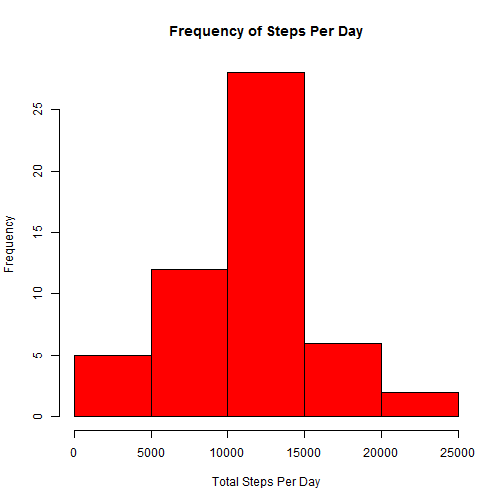
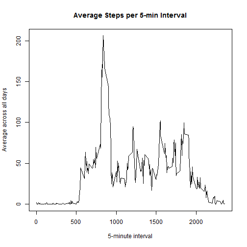
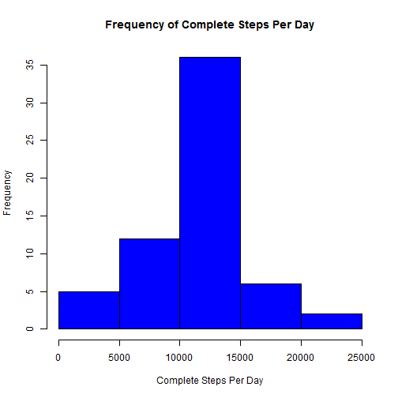
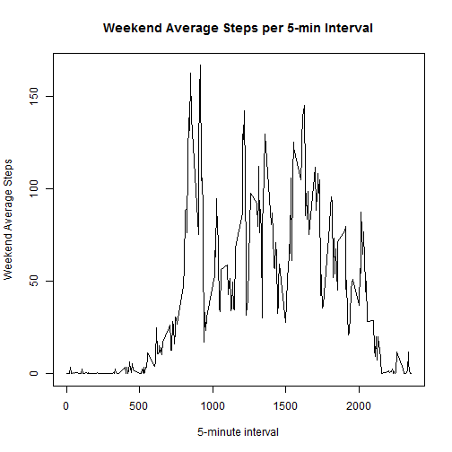
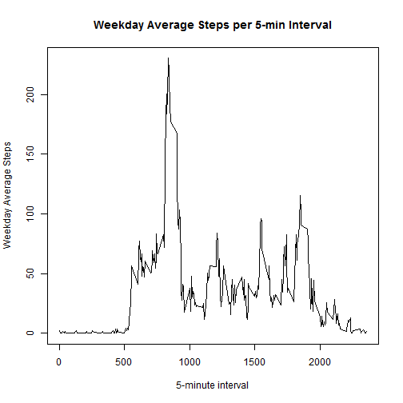

## Loading and preprocessing the data
Loading the data

```r
activityData <- read.csv("activity.csv")
```


## What is mean total number of steps taken per day?
1. Calculating the total number of steps taken per day
    
    ```r
    totalStepsPerDay <- aggregate(activityData$steps, list(activityData$date), sum)
    
    # Renaming the columns appropriately
    names(totalStepsPerDay) <- c('date','steps')
    ```
2. Histogram showing the frequency of total number of steps taken each day 
    
    ```r
    hist(totalStepsPerDay$steps
        , main="Frequency of Steps Per Day"
        , xlab = "Total Steps Per Day"
        , col="red")
    ```
    
     
3. Calculating and reporting the MEAN and MEDIAN of the total number of steps taken per day
    - MEAN
        
        ```r
        mean(totalStepsPerDay$steps, na.rm = TRUE)
        ```
        
        ```
        ## [1] 10766.19
        ```
    - MEDIAN
        
        ```r
        median(totalStepsPerDay$steps, na.rm = TRUE)
        ```
        
        ```
        ## [1] 10765
        ```

## What is the average daily activity pattern?
1. Time series plot of the 5-minute interval (x-axis) and the average number of steps taken, averaged across all days (y-axis)
    - Aggregate the appropriate data
      
      ```r
      avgStepsPerInterval <- aggregate(activityData$steps
          , list(activityData$interval)
          , FUN = mean
          , na.rm = TRUE)
          
      #Renaming the columns appropriately
      names(avgStepsPerInterval) <- c("interval","average")
      ```
    - Create the plot
        
        ```r
        plot(avgStepsPerInterval$interval
            , avgStepsPerInterval$average
            , type="l"
            , ylab="Average across all days"
            , xlab="5-minute interval"
            , main="Average Steps per 5-min Interval")
        ```
        
         
2. The 5-minute interval, on average across all the days in the dataset, containing the maximum number of steps
    
    ```r
    avgStepsPerInterval[avgStepsPerInterval$average == max(avgStepsPerInterval$average)
        ,c("interval", "average")]
    ```
    
    ```
    ##     interval  average
    ## 104      835 206.1698
    ```

## Imputing missing values
1. Calculating and reporting the total number of missing values in the dataset
    
    ```r
      sum(is.na(activityData))
    ```
    
    ```
    ## [1] 2304
    ```
2. Strategy for filling in the missing values will be based on the average value across all days for the given interval.  

3. Creating new dataset with the same number of observations as the original dataset but with the missing data filled in
    - Merge original data with the average number of steps per interval
        
        ```r
        completeData <- merge(activityData, avgStepsPerInterval, BY="interval")
        ```
    - Replace the NA values with the associated average steps per interval
        
        ```r
        completeData$steps[is.na(completeData$steps)] <- completeData$average[is.na(completeData$steps)]
        
        # Set order by date, then by interval
        completeData <- completeData[order(completeData$date,completeData$interval),]
        ```
    - Calculate the total number of steps per day based on the complete data set
        
        ```r
        completeStepsPerDay <- aggregate(completeData$steps, list(completeData$date), sum)
            
        # Renaming the columns appropriately
        names(completeStepsPerDay) <- c('date','steps')
        
        # Remove average column as it is no longer needed
        completeData$average <- NULL
        ```
    - Create the histgram based on the complete data set showing the frequency of total number of steps taken each day 
        
        ```r
        hist(completeStepsPerDay$steps
            , main="Frequency of Complete Steps Per Day"
            , xlab = "Complete Steps Per Day"
            , col="blue")
        ```
        
         
    - Calculating and reporting the MEAN and MEDIAN of the total number of steps taken per day based on the complete data set
        
        ```r
        # MEAN
        mean(completeStepsPerDay$steps, na.rm = TRUE)
        ```
        
        ```
        ## [1] 10766.19
        ```
        
        ```r
        # MEDIAN
        median(completeStepsPerDay$steps, na.rm = TRUE)
        ```
        
        ```
        ## [1] 10766.19
        ```
      Using the average interval values to replace the missing data, seemed to not affect the MEAN or MEDIAN values, with the exception of the MEDIAN is now not a whole integer. However, there is an increase in frequency on the HISTOGRAM

## Are there differences in activity patterns between weekdays and weekends?
1. Add a new variable to the complete data that contains a factor of "weekday" or "weekend"
    
    ```r
    completeData$daytype <- ifelse(as.numeric(format(as.Date(completeData$date), "%u")) < 6, "weekday","weekend")
    ```
2. Two panel plots containing a time series plot of the 5-minute interval averages on weekday steps and weekend steps.
    - Create two seperate data sets.  One for weekday averages and one for weekend averages
        
        ```r
        weekdayData <- completeData[completeData$daytype == "weekday",]
        weekdayAvg <- aggregate(weekdayData$steps, list(weekdayData$interval), FUN = mean, na.rm = TRUE)
        names(weekdayAvg) <- c("interval","average")
        
        weekendData <- completeData[completeData$daytype == "weekend",]
        weekendAvg <- aggregate(weekendData$steps, list(weekendData$interval), FUN = mean, na.rm = TRUE)
        names(weekendAvg) <- c("interval","average")
        ```
    - Generate the appropriate plot panels  
        
        ```r
        plot(weekendAvg$interval
            , weekendAvg$average
            , type="l"
            , ylab="Weekend Average Steps"
            , xlab="5-minute interval"
            , main="Weekend Average Steps per 5-min Interval")
        ```
        
         
        
        ```r
        plot(weekdayAvg$interval
            , weekdayAvg$average
            , type="l"
            , ylab="Weekday Average Steps"
            , xlab="5-minute interval"
            , main="Weekday Average Steps per 5-min Interval")
        ```
        
         
    

